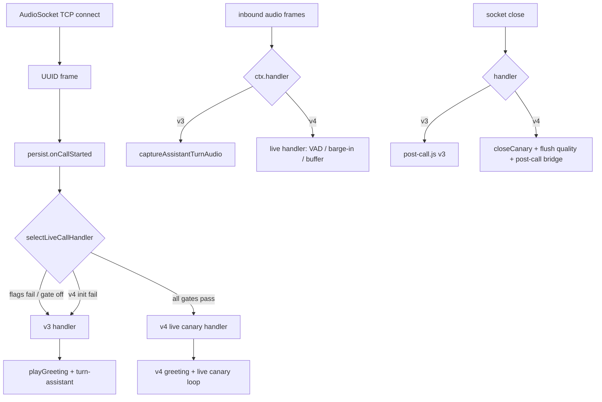

# TechnoloHit Voice Assistant v4 — Phase 10 Live AudioSocket → v4 Canary Wiring Blueprint

Date: 2026-06-01  
Status: **Implementation blueprint only — no code in this deliverable; production v4 NOT enabled**  
Prior: [Phase 9b supervised canary blueprint](./voice_assistant_v4_phase9b_supervised_canary_blueprint.md)  
Production: `voice-bridge-v1.11.0`, v3 active, all v4 flags off

---

## 1. Current blocker

### What works today (v1.11.0)

| Layer | State |
|-------|--------|
| Live PSTN AudioSocket | `audiosocket.js` → greeting → `turn-assistant.js` (v3) |
| v4 modules | Implemented as **test harness / stub** (Phases 3–8) |
| `resolveRuntimeRoute()` | Returns `runtime: "v4"` with **`active: false`, `stub: true`** when env flags set |
| `routeAudioSocketCall()` | Requires `harnessExplicit: true` — **never set on live calls** |
| `createCanaryDialogueRuntime()` | Same `harnessExplicit` gate; `simulateInboundTranscriptTurn()` drives QA in tests |
| Quality DB flush | v4-path only (`v3_path_no_flush` on v3) |
| Production env | `VOICE_RUNTIME_VERSION=v3`; Tier **9b-B** dialogue QA **blocked** |

### Gap

**Live PSTN still routes through v3 `turn-assistant`.** Real inbound PCM frames are not fed into `audio-session`, VAD, STT, dialogue orchestrator, TTS playback-controller, or v4 quality persistence. Enabling v4 env flags today only changes startup logs — not call behavior.

---

## 2. Target end state

A **strictly flag-gated** live canary path that:

- Leaves **v3 as default** for all calls when flags are off or gates fail.
- Activates v4 canary **only** when every required flag and safety gate passes at **call start**.
- Supports optional barge-in when `VOICE_V4_BARGE_IN_ENABLED=true`.
- Does **not** constitute “production v4 GA” — supervised canary / QA only until Phase 9c approval.

### Required env (minimum for live canary consideration)

```env
VOICE_RUNTIME_VERSION=v4
VOICE_V4_REALTIME_ENABLED=true
VOICE_V4_CANARY_ENABLED=true
```

### Recommended additional live gate (new — Phase 10A)

```env
VOICE_V4_LIVE_AUDIOSOCKET_ENABLED=false   # default off; explicit opt-in for live wiring
```

Rationale: today `VOICE_V4_CANARY_ENABLED` only prepares stub/harness contexts. A **separate live gate** prevents accidental live takeover when someone sets canary flags during ops experiments. All four must be `true` for live v4 path.

### Optional flags (scenario blocks)

```env
VOICE_V4_BARGE_IN_ENABLED=false
VOICE_V4_STREAMING_STT_ENABLED=false
VOICE_V4_STREAMING_TTS_ENABLED=false
VOICE_RAG_ENABLED=false
VOICE_RAG_SALES_ANSWERER_ENABLED=false
```

### Default production (unchanged)

```env
VOICE_RUNTIME_VERSION=v3
VOICE_V4_REALTIME_ENABLED=false
VOICE_V4_CANARY_ENABLED=false
VOICE_V4_LIVE_AUDIOSOCKET_ENABLED=false
# all other VOICE_V4_* false
```

---

## 3. Architecture decision

### 3.1 Routing model per call



**Single decision point:** immediately after `persist.onCallStarted()` on UUID setup (in `audiosocket.js`), call a new helper:

```text
voice-bridge/src/v4/live-audiosocket-handler.js
  selectLiveCallHandler(config, ctx) → { handler, reason, runtime }
  startLiveCanaryCall(config, ctx, socket, runtime)
  handleLiveCanaryInboundFrame(config, ctx, socket, payload)
  finishLiveCanaryCall(config, ctx, reason)
```

Keep `audiosocket.js` thin: branch on `ctx.callHandler === 'v4_canary' | 'v3'`.

### 3.2 Gate logic (fail closed → v3)

Live v4 handler is selected **only if all** are true:

| # | Condition |
|---|-----------|
| 1 | `canPrepareV4CanaryMedia(config)` — i.e. `runtimeVersion=v4`, `realtimeEnabled`, `canaryEnabled` |
| 2 | `VOICE_V4_LIVE_AUDIOSOCKET_ENABLED=true` (new) |
| 3 | Agent config loads (`loadAgentConfig`) |
| 4 | DB persistence available if quality flush required (or degrade with log — see 3.4) |
| 5 | Optional QA allowlist passes (recommended new env — see 3.3) |
| 6 | `createLiveCanaryRuntime()` succeeds (orchestrator + adapters + quality sink) |

If **any** check fails: log structured reason, set `ctx.callHandler = 'v3'`, run existing v3 path. **Do not drop the call.**

### 3.3 QA allowlist (recommended — no public exposure)

Add optional env to restrict live v4 to approved test ingress:

```env
VOICE_V4_LIVE_CANARY_ALLOWLIST=   # empty = live gate blocked even if LIVE_AUDIOSOCKET=true (safest default)
# OR comma-separated bridge_call_id prefixes / DID suffix hashes — not full numbers in env docs
```

**Decision:** Default **empty allowlist = no live v4** even when all flags true. Operator must set a non-empty allowlist entry matching a dedicated QA route/DID pattern during maintenance window only.

Alternative for first implementation: allowlist matches `ctx.bridgeCallId` prefix configured for QA trunk (documented in Sysadmin runbook, not committed).

### 3.4 Fail closed vs drop call

| Situation | Behavior |
|-----------|----------|
| Pre-call gate failure | **Fail closed to v3** — normal greeting + turn-assistant |
| v4 runtime init throws on UUID | Catch, log, **fallback v3** for that call |
| Mid-call v4 uncaught error | Catch in frame handler; **stop v4 processing**, log `runtime_error`, play brief silence/keepalive, **attempt v3 turn-assistant attach** (Phase 10D+) or orderly hangup with post-call — **never crash socket loop** |
| Asterisk overload / capacity | Out of scope for Phase 10 code — ops blocks concurrent canary calls |
| Privacy guard blocks quality insert | Skip insert, log `privacy_guard_blocked`; **do not fail call** |
| RAG failure | Fail-closed to playbook (existing `rag-orchestrator`) |
| STT/TTS failure | Spoken fallback phrase; skip turn or retry once; no unhandled rejection |

**Never** drop TCP connection solely because v4 was requested — PSTN caller must hear something or v3 fallback.

### 3.5 Coexistence with v3 paths

When `ctx.callHandler === 'v4_canary'`:

- **Do not** call `captureAssistantTurnAudio()` (avoid dual STT).
- **Do** keep `captureInboundAudio()` if recording enabled (existing compliance path).
- **Do not** call `startOneTurnAssistant()` unless fallback to v3.
- Phase 0B spike (`playback-session.js` cancel) must **not** run concurrently with v4 `playback-controller` on same call — guard spike flags off when live canary active.

### 3.6 Replace `harnessExplicit` for live only

| Context | Opt-in mechanism |
|---------|------------------|
| Unit/integration tests | Keep `harnessExplicit: true` in test inputs |
| Live AudioSocket | Env gates + allowlist + successful `createLiveCanaryRuntime()` — **no** `harnessExplicit` in production code paths |

Update `createCanaryDialogueRuntime()` to accept `liveCanary: true` when called from `live-audiosocket-handler.js` (internal only, not env). Tests unchanged.

### 3.7 `resolveRuntimeRoute()` evolution (Phase 10G)

When live wiring ships, extend router so startup log reflects live-capable state:

```text
selected=v4 live_canary_eligible=true active=<per-call> reason=v4_live_canary_ready
```

Per-call `active` remains false at startup — activation happens at UUID. Avoid repeating v1.11.0 confusion: rename log field `v4_active` → `v4_route_loaded` in a small follow-up cleanup.

---

## 4. Minimal implementation phases

Each sub-phase ships behind flags default-off; v3 unchanged when flags false.

### Phase 10A — Route selection and lifecycle logging

**Goal:** Wire call-start decision; v4 path logs lifecycle only (no real STT/TTS yet).

**Changes:**

- New `live-audiosocket-handler.js` with `selectLiveCallHandler`, `canActivateLiveV4Canary(config, ctx)`.
- New config: `VOICE_V4_LIVE_AUDIOSOCKET_ENABLED`, optional `VOICE_V4_LIVE_CANARY_ALLOWLIST`.
- `audiosocket.js`: on UUID, select handler; branch greeting path.
- v4 selected: log `[v4-live] call_start handler=v4_canary reason=... bridge_call_id=... call_session_id=...`; play existing greeting via shared `streamPcmToSocket`; **no** turn-assistant; inbound frames counted only.
- v4 `finish`: log `[v4-live] call_end`; no quality flush yet.

**Exit criteria:** With all flags true + allowlist match, logs show v4 lifecycle; PSTN still hears greeting; v3 calls identical to today.

### Phase 10B — Inbound frame ingestion + VAD / endpointing

**Goal:** Feed live PCM into v4 `audio-session` + `vad-endpointing`.

**Changes:**

- `handleLiveCanaryInboundFrame`: RMS via `pcm-rms.js`, `observeInboundFrame(vadState, rms)`, `appendInboundFrame(session)`.
- On endpoint: emit quality event `vad_endpoint_detected` (buffered, not yet spoken).
- Buffer PCM segments for STT (Phase 10C).

**Exit criteria:** Logs/metrics show endpoint detection on live speech; no v3 turn-assistant triggered.

### Phase 10C — STT adapter integration

**Goal:** On endpoint, run `stt-adapter` (mock or OpenAI when `VOICE_V4_STREAMING_STT_ENABLED` approved).

**Changes:**

- Wire `createSttAdapter` with `enabled` from config.
- On STT failure: quality event `runtime_error` / `stt_failed`; spoken v3-style fallback line via TTS mock or canned PCM; **fail safe**.
- Do not log full transcript when `VOICE_LOG_TRANSCRIPT_PREVIEW=false`.

**Exit criteria:** Live utterance produces transcript inside orchestrator path (internal); fallback on forced STT error passes tests.

### Phase 10D — Response planner / orchestrator integration

**Goal:** Connect STT final text to `dialogue-orchestrator` (`startTurn` → `acceptUserTranscript` → `decideNextAction` → `prepareAssistantResponse`).

**Changes:**

- Refactor `createCanaryDialogueRuntime()` → export `createLiveCanaryRuntime(config, ctx)` sharing orchestrator setup from `canary-runtime-loop.js`.
- Multi-turn loop on live call until `closeCall` or max turns from agent config.
- Lead creation only via existing validators (`lead-candidate.js`, `lead-validator.js`).
- RAG: wire `retrieveV4RagAnswer` when `VOICE_RAG_ENABLED` (Phase 6) — product/sales only.

**Exit criteria:** Harness tests + one supervised live call can complete intake/product Q&A path in canary.

### Phase 10E — TTS playback through playback-controller

**Goal:** Stream assistant PCM to socket via `playback-controller` + `streamPcmToSocket` with cancel support.

**Changes:**

- `observeOutboundFrameForPlayback` on each sent frame.
- Stop silence writer during outbound playback; resume between turns.
- TTS failure: playbook short reply or silence + retry once.

**Exit criteria:** Caller hears v4 assistant audio; metrics `tts_completed` in quality buffer.

### Phase 10F — Barge-in enabled path

**Goal:** When `VOICE_V4_BARGE_IN_ENABLED=true`, use `barge-in-detector` + `requestPlaybackCancel` on live inbound during playback.

**Changes:**

- Reuse `observeInboundFrameForBargeIn` from `audiosocket-runtime.js`.
- On cancel: `handleInterruption` → recovery planner.
- Quality events: `playback_cancel_requested`, `playback_cancelled`, `barge_in_detected`.

**Exit criteria:** Phase 4 harness behaviors reproduced on live call; barge-in off → no cancel.

### Phase 10G — Quality event persistence

**Goal:** On v4 call close, `flushOrchestratorQualityEvents` → `voice.call_quality_events`.

**Changes:**

- `createDbQualityEventInsertFn` in live runtime setup (`persistQualityToDb: true` when DB configured).
- `finishLiveCanaryCall` awaits flush; handoff to `post-call-bridge.js` metadata.
- v3 calls: **zero** quality rows (regression guard).

**Exit criteria:** Supervised canary call produces redacted rows; privacy scan SQL clean.

### Phase 10H — Supervised live QA runbook

**Goal:** Update Phase 9b runbook / new Phase 10 operator doc for Tier 9b-B execution post-wiring.

**Deliverable:** `voice_assistant_v4_phase10_live_qa_runbook.md` (after 10A–10G code merged) — maintenance window, flags, rollback, Phase 8 SQL, stop criteria.

**Exit criteria:** Sysadmin can execute Tier 9b-B scenario matrix from [Phase 9b blueprint §E](./voice_assistant_v4_phase9b_supervised_canary_blueprint.md#e-test-scenarios-call-qa-matrix).

---

## 5. Safety rules

| Rule | Implementation note |
|------|---------------------|
| v3 one-command rollback | Revert env to §2 defaults + restart container — no code deploy required |
| No lead without validators | Use Phase 7 `lead-candidate` + strict callback policy; invalid phone → `lead_skipped` |
| No full phone in logs/events | `privacy-sanitize.js`, `assertNoRawPhoneInPayload`, redacted quality payloads |
| RAG product/sales Q&A only | Phase 6 guards; never RAG for contact/permission/lead |
| Quality events v4-only | `v4PathActive: true` on orchestrator; flush guard unchanged |
| Errors fail safe | try/catch on every async v4 boundary; never `throw` through `handleFrame` |
| No dual runtime | Exclusive handler per call on `ctx.callHandler` |
| Default off | All new env vars default `false`; empty allowlist blocks live path |
| No production v4 GA | Live canary ≠ `VOICE_RUNTIME_VERSION=v4` as default for all traffic |

---

## 6. Required tests

New file suggested: `voice-bridge/tests/v4-phase10-live-audiosocket-wiring.test.js`

| # | Test | Phase |
|---|------|-------|
| T1 | `selectLiveCallHandler` defaults to v3 with factory config | 10A |
| T2 | v4 env flags without `VOICE_V4_CANARY_ENABLED` → v3 | 10A |
| T3 | v4 + canary + realtime without `VOICE_V4_LIVE_AUDIOSOCKET_ENABLED` → v3 | 10A |
| T4 | All flags true but empty allowlist → v3 | 10A |
| T5 | All gates pass + allowlist match → `handler=v4_canary` | 10A |
| T6 | `createLiveCanaryRuntime` failure → fallback v3 | 10A |
| T7 | Inbound PCM updates `audioSession.inboundFrames` | 10B |
| T8 | VAD endpoint fires after speech + silence frames | 10B |
| T9 | STT adapter error → fallback result, no throw | 10C |
| T10 | TTS adapter error → fallback result, no throw | 10E |
| T11 | Barge-in cancel only when `VOICE_V4_BARGE_IN_ENABLED` | 10F |
| T12 | Quality events pass `assertNoRawPhoneInPayload` | 10G |
| T13 | v3 path: `captureAssistantTurnAudio` still invoked; no v4 runtime | 10A |
| T14 | v4 path: `captureAssistantTurnAudio` **not** invoked | 10A |
| T15 | `flushOrchestratorQualityEvents` returns `v3_path_no_flush` on v3 orchestrator | 10G |
| T16 | Integration: UUID frame flow routes to v3 handler in audiosocket server mock | 10A |

Run full suite after each sub-phase; no regression in existing 212+ voice-bridge tests.

---

## 7. Sysadmin / live QA needs (post-implementation)

Reference: [Phase 9b sysadmin canary runbook](./voice_assistant_v4_phase9b_sysadmin_canary_runbook.md)

| Need | Detail |
|------|--------|
| Maintenance window | ≤ 30 min; single concurrent canary call |
| Test call route | Dedicated QA DID/trunk; allowlist entry configured |
| Image | New tag after Phase 10 merge (e.g. `v1.12.0`); pin immutable |
| Env backup | `.env.pre-phase10-<stamp>.bak` before enabling live gate |
| Rollback | Restore v3 env; optional image pin `voice-bridge-v1.11.0` |
| Logs | Redacted docker logs; grep `[v4-live]` |
| SQL | [Phase 8 quality analytics queries](./voice_assistant_v4_phase8_quality_analytics_queries.sql) + 9b 30m snippets |
| RAG | Co-deploy `rag-api-v1.11.0+` before RAG scenarios; `http://127.0.0.1:8080` |
| Stop criteria | [Phase 9b blueprint §H](./voice_assistant_v4_phase9b_supervised_canary_blueprint.md#h-stop--rollback-criteria) |

Production blockers (retention, backup encryption, QA route, overload, OpenAI limits) **remain open** — Phase 10 code does not clear them.

---

## 8. Files to touch (implementation preview)

| File | Role |
|------|------|
| `voice-bridge/src/audiosocket.js` | Handler branch on UUID + inbound + finish |
| `voice-bridge/src/v4/live-audiosocket-handler.js` | **New** — live call lifecycle |
| `voice-bridge/src/v4/canary-runtime-loop.js` | Extract `createLiveCanaryRuntime`; `liveCanary` opt-in |
| `voice-bridge/src/v4/runtime-router.js` | Live-eligible route metadata; optional `canActivateLiveV4Canary` |
| `voice-bridge/src/v4/audiosocket-runtime.js` | Reuse media helpers; deprecate live `harnessExplicit` requirement |
| `voice-bridge/src/config.js` | New env keys |
| `voice-bridge/.env.example` | Document new flags default off |
| `docs/voice-bridge-runtime-env.md` | Live canary section |
| `voice-bridge/tests/v4-phase10-live-audiosocket-wiring.test.js` | **New** |

**Do not expand** `turn-assistant.js` for v4 logic.

---

## 9. Acceptance criteria (Phase 10 complete)

- [ ] Live call with all gates off uses v3 exclusively (production default).
- [ ] Live call with gates on + allowlist uses v4 canary end-to-end (10A–10G).
- [ ] Tier 9b-B scenario matrix executable under supervision.
- [ ] Rollback to v3 env restores prior behavior without migration rollback.
- [ ] Production v4 GA **not** implied; blockers still tracked.

---

## 10. Recommended implementation prompt — Phase 10A only

Use this prompt when ready to implement (not now):

```text
Task: Implement Phase 10A — Live AudioSocket v4 canary route selection and lifecycle logging only.

Reference:
- docs/Tasks/voice_assistant_v4_phase10_live_audiosocket_canary_wiring_blueprint.md (sections 3, 4 Phase 10A, 5, 6 T1–T6, T13–T14, T16)

Boundaries:
- Do NOT enable production v4 by default.
- Default all new env vars to false.
- Do NOT expand turn-assistant.js.
- Fail closed to v3 on any gate failure — never drop calls.
- Do not log secrets or full phone numbers.

Implement:
1. Add VOICE_V4_LIVE_AUDIOSOCKET_ENABLED (default false) and VOICE_V4_LIVE_CANARY_ALLOWLIST (default empty) to config.js + .env.example.
2. Create voice-bridge/src/v4/live-audiosocket-handler.js with:
   - canActivateLiveV4Canary(config, ctx)
   - selectLiveCallHandler(config, ctx) → { handler: 'v3'|'v4_canary', reason, runtime }
   - startLiveCanaryCall(config, ctx, socket, runtime) — greeting only, log [v4-live] call_start
   - handleLiveCanaryInboundFrame — frame count + debug log only in 10A
   - finishLiveCanaryCall — log [v4-live] call_end
3. Wire audiosocket.js: after onCallStarted on UUID, select handler; branch greeting;
   skip captureAssistantTurnAudio when handler is v4_canary; route inbound/finish.
4. Extend canary-runtime-loop.js with createLiveCanaryRuntime(config, ctx) that sets liveCanary: true
   (orchestrator optional minimal stub for 10A — lifecycle only OK).
5. Empty allowlist must block live v4 even when other flags true.
6. Add voice-bridge/tests/v4-phase10-live-audiosocket-wiring.test.js covering T1–T6, T13, T14, T16.

Tests: run voice-bridge test suite; no production env changes.

Deliver: short Phase 10A implementation report; list files changed.
```

---

## 11. Relationship to Phase 9b / 9c

```text
Phase 9   — schema + v1.11.0 deploy (v3)           [done]
Phase 9b  — canary validation plan                  [docs done]
Phase 10  — live AudioSocket wiring               [this blueprint — implementation next]
Phase 9b-B — full dialogue QA on production       [blocked until Phase 10G + 10H]
Phase 9c  — supervised production v4 enablement   [blocked — rollout blockers]
```

Phase 10 unblocks **Tier 9b-B**; it does **not** unblock **Phase 9c** (general availability).
